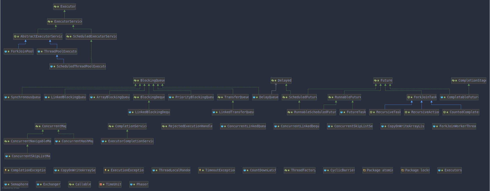
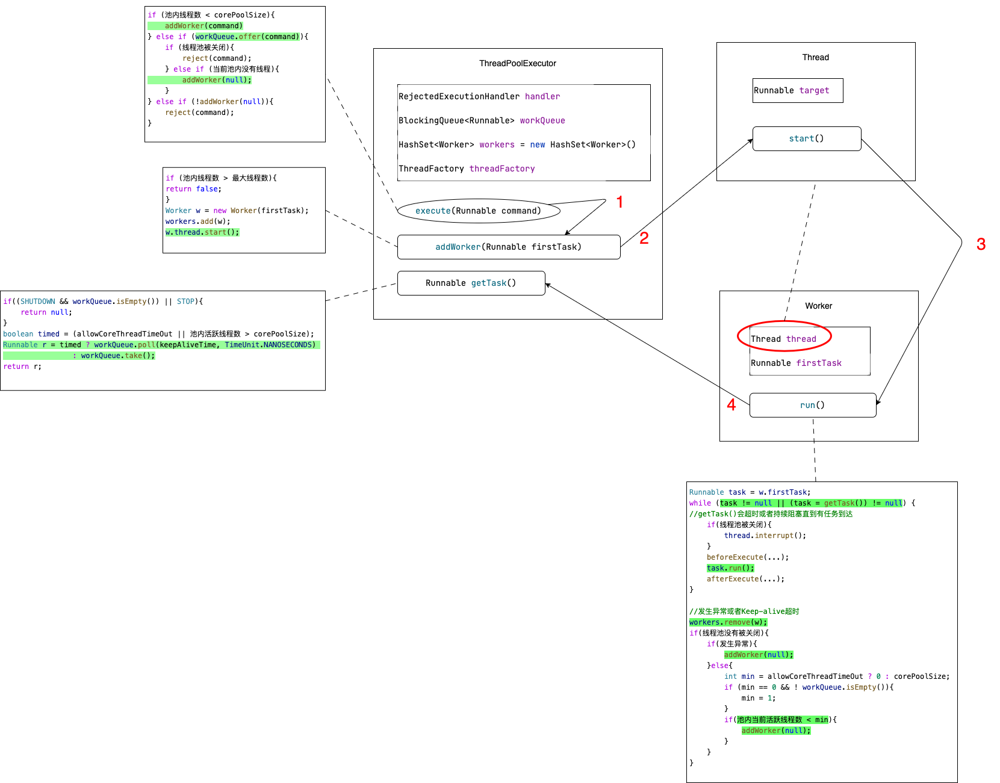
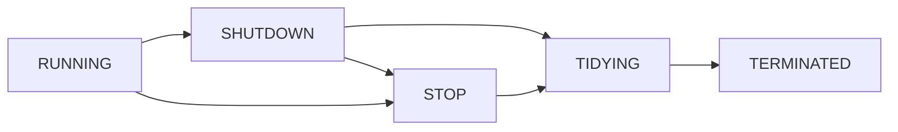
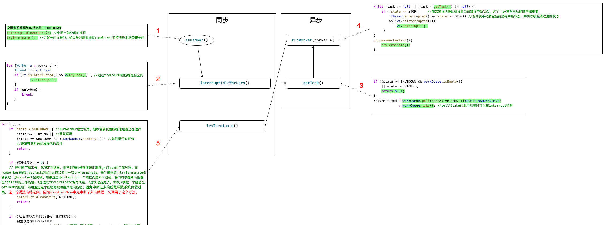
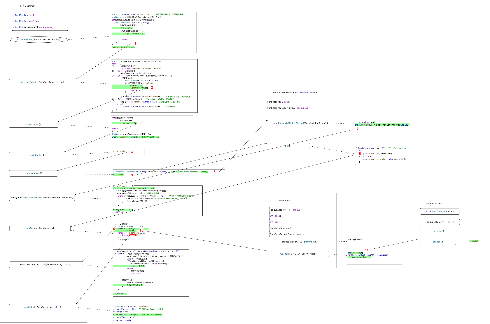

基于 jdk8 [https://docs.oracle.com/javase/8/docs/api/index.html](https://docs.oracle.com/javase/8/docs/api/index.html)

## 概览



## Executor

该接口只有一个方法 `execute(Runnable command)` 用于执行提交的 `Runnable` 任务。这个接口的目的是把任务的提交从任务的运行细节中进行解耦，使用者只需要提交任务到执行器，屏蔽了执行器使用线程、进行调度的具体细节。使用了执行器后不需要为每一个任务调用 `new Thread(new RunnableTask()).start()`。

注意，`Executor` 接口不严格限制实现类必须异步执行任务，执行器可以通过直接调用 `r.run()` 在调用线程中运行提交的任务。也就是说提交的任务有可能在一个新线程中执行，有可能在一个线程池中执行，也有可能在调用线程中执行。

JUC 包中提供的实现类同时也都实现了一个功能更丰富的接口 `ExecutorService` 。

`ThreadPoolExecutor` 是一个可扩展的线程池实现类。

`Executors` 工具类为创建不同种类的线程池实现类提供了方便的工厂方法。

提交任务遵循 [Happens-before](/posts/happens-before-order "Happens-before") 顺序

## ExecutorService

属于 Java 中的 Executor 框架。它提供了管理终止和跟踪异步任务进度的方法。ExecutorService 可以被关闭，这将导致它拒绝新的任务。提供了两种不同的方法来关闭ExecutorService 。shutdown 方法允许之前提交的任务在终止之前执行，而 shutdownNow 方法则防止等待任务启动并尝试停止当前正在执行的任务。在终止时，执行器没有任务正在执行，没有任务等待执行，也不能提交新的任务。未使用的 ExecutorService 应该被关闭以允许回收其资源。方法 submit 通过创建并返回可用于取消执行和/或等待完成的 Future 来扩展基本方法Executor.execute(Runnable)。方法 invokeAny 和 invokeAll 执行最常用的批量执行形式，执行一组任务，然后等待至少一个或全部完成。Executors 类提供了工厂方法，用于提供此包中提供的执行器服务。

## AbstractExecutorService

`AbstractExecutorService` 类提供了 `ExecutorService` 执行方法的默认实现。在默认实现的 `submit`、`invokeAny` 和 `invokeAll` 方法中，会把参数 `Runnable` 或 `Callable` 使用过 `newTaskFor` 方法包装成 `RunnableFuture` 对象来运行。

## ThreadPoolExecutor



`ExecutorService` 使用线程池来执行提交的任务，通常使用 `Executors` 工厂方法进行配置。线程池解决了两个不同的问题：当执行大量异步任务时，它们通常提供了更好的性能，因为减少了每个任务调用的开销；同时，它们提供了一种管理资源、线程的方式，以便在执行任务集合时限制和管理这些资源的消耗。每个 `ThreadPoolExecutor`还维护一些基本的统计信息，例如已完成的任务数。为了在广泛的上下文中有用，该类提供了许多可调参数和可扩展性钩子。

然而，更多情况下应该使用更方便的 `Executors` 工厂方法 `Executors.newCachedThreadPool`（无限制线程池，具有自动线程回收），`Executors.newFixedThreadPool`（固定大小线程池）和 `Executors.newSingleThreadExecutor`（单个后台线程），这些方法预配置了最常见的使用场景的设置。

否则，在手动配置和调整此类时，请注意以下问题：

### 线程池的最小和最大线程数量

`ThreadPoolExecutor`将根据 `corePoolSize`和 `maximumPoolSize`设置的边界自动调整池大小（参见 `getPoolSize`）。当在 `execute(Runnable)`方法中提交新任务，并且正在运行的线程少于 `corePoolSize`时，即使其他工作线程处于空闲状态，也将创建一个新线程来处理请求。如果正在运行的线程数大于 `corePoolSize`但小于 `maximumPoolSize`，则仅当队列已满时才会创建新线程。通过将 `corePoolSize`和 `maximumPoolSize`设置为相同的值，可以创建一个固定大小的线程池。通过将 `maximumPoolSize`设置为一个基本上无限制的值，例如 `Integer.MAX_VALUE`，可以允许池容纳任意数量的并发任务。通常，核心和最大池大小仅在构造时设置，但也可以使用 `setCorePoolSize`和 `setMaximumPoolSize`动态更改。

### 按需构建

默认情况下，即使是核心线程，也仅在有新任务到达时才会创建和启动，但是可以使用 `prestartCoreThread`或 `prestartAllCoreThreads`方法动态地覆盖此行为。如果使用非空的任务队列创建线程池，则可能需要预启动线程。

### 如何创建新线程

```java
    private volatile ThreadFactory threadFactory;

    private static final RuntimePermission shutdownPerm = new RuntimePermission("modifyThread");
```

使用 `ThreadFactory`创建新线程。如果没有另外指定，将使用 `Executors.defaultThreadFactory`，它创建的线程都在同一个 `ThreadGroup`中，并具有相同的 `NORM_PRIORITY`优先级和非守护进程状态。通过提供不同的 `ThreadFactory`，可以更改线程的名称、线程组、优先级、守护进程状态等。如果 `ThreadFactory` 在调用 `newThread` 创建线程时返回 `null` ，则执行程序将继续运行，但可能无法执行任何任务。线程池具有 “modifyThread” 的 `RuntimePermission`。"modifyThread" 权限它允许调用 `shutdown` 和 `shutdownNow`。通常，需要修改线程状态的代码（例如更改线程优先级或中断线程）需要此权限。要将此权限授予 Java 应用程序，您可以将以下行添加到应用程序的安全策略文件中，`grant java.lang.RuntimePermission "modifyThread";`这将允许应用程序在运行时修改线程。但是，授予此权限可能存在风险，因为它允许应用程序潜在地干扰 Java 虚拟机的正常操作。因此，它应该只授予需要它的可信代码。

`addWorker` 创建线程时有可能因为受到系统或用户控制创建失败。最常见的是 OutOfMemoryError ，因为需要给新的线程分配堆栈。

### Keep-alive

线程池中线程的保活时间。如果池当前有超过 `corePoolSize`个线程，那么如果它们空闲时间超过 `keepAliveTime`（参见 `getKeepAliveTime(TimeUnit)`），则多余的线程将被终止。这提供了一种在池没有活跃时减少资源消耗的方法。如果线程池池稍后变得更加活跃，将构造新线程。可以使用 `setKeepAliveTime(long, TimeUnit)`方法动态更改此参数。使用 `Long.MAX_VALUE TimeUnit.NANOSECONDS` 可以防止线程被回收。默认情况下，仅适用于池内线程个数超过 `corePoolSize` 个线程的情况。但是，`allowCoreThreadTimeOut(boolean)`方法可以用于将此超时策略应用于核心线程，只要 `keepAliveTime`值为非零即可。

### 任务队列

Java中的线程池中的任务队列可以使用任何实现了BlockingQueue接口的队列。线程池的使用与队列的选择有关：

1. 如果正在运行的线程数少于 `corePoolSize`，则执行器始终优先添加新线程而不是排队。
2. 如果正在运行的线程数等于或大于 `corePoolSize`，则执行器始终优先将请求排队而不是添加新线程。
3. 如果无法将请求排队，则创建一个新线程，除非这将超过 `maximumPoolSize`，否则将拒绝该任务。

有三种常见的队列策略：

1. 不排队。对于工作队列来说，SynchronousQueue 是一个很好的默认选择，它将任务直接交给线程而不会保留它们。在这里，如果没有立即可用的线程来运行任务，将构造一个新线程。这种策略避免了处理可能具有内部依赖关系的请求集时出现死锁。直接交接通常需要无限制的 `maximumPoolSizes`，以避免拒绝新提交的任务。命令的平均到达速度比它们可以被处理的速度更快时，可能导致线程无限增长。
2. 无界队列。使用无界队列（例如没有预定义容量的 LinkedBlockingQueue）将导致新任务在所有 `corePoolSize` 线程都忙时等待队列。因此，最多只会创建 `corePoolSize`个线程。（因此，`maximumPoolSize`的值没有作用。）当每个任务完全独立于其他任务时，这可能是适当的，因此任务不能影响彼此的执行。当命令的平均到达速度比它们可以被处理的速度更快时，会导致工作队列无限增长。
3. 有界队列。有界队列（例如ArrayBlockingQueue）有助于在使用有限 `maximumPoolSizes`时防止资源耗尽，但可能更难以调整和控制。队列大小和最大池大小可以相互交换：使用大队列和小池最小化CPU使用率、操作系统资源和上下文切换开销，但可能导致人为降低吞吐量。如果任务经常阻塞（例如，如果它们是I/O绑定的），则系统可能能够为更多线程安排时间，而不是您允许的线程数。使用小队列通常需要更大的池大小，这使CPU更忙碌，但可能会遇到不可接受的调度开销，这也会降低吞吐量。

方法 `getQueue()` 允许访问工作队列，以便进行监视和调试。强烈不建议将此方法用于任何其他目的。当大量排队的任务被取消时，提供了两个方法 `remove(Runnable)` 和 `purge` 来协助存储回收。在判断任务队列是否为空时，不能仅仅依赖于 `poll()` 方法返回 `null`，而应该使用 `isEmpty()` 方法来判断。这是因为有些特殊的队列，比如 `DelayQueue`，即使队列中有元素，`poll()` 方法也可能返回 `null`，只有等到延迟时间过后才会返回非空。因此，为了保证线程池的正常运行，需要使用 `isEmpty()` 方法来判断任务队列是否为空。

### 拒绝策略

```java
    private volatile RejectedExecutionHandler handler;

    private static final RejectedExecutionHandler defaultHandler = new AbortPolicy();
```

在方法 `execute(Runnable)` 中提交的新任务将在执行器已关闭时被拒绝，以及当执行器对最大线程数和工作队列容量都使用有限边界，并且已经饱和时也会被拒绝。在任一情况下，`execute`方法都会调用其RejectedExecutionHandler的 `RejectedExecutionHandler.rejectedExecution(Runnable, ThreadPoolExecutor)`方法。提供了四种预定义的处理程序策略：

1. 在默认的ThreadPoolExecutor.AbortPolicy中，处理程序在拒绝时抛出运行时RejectedExecutionException。
2. 在ThreadPoolExecutor.CallerRunsPolicy中，调用 `execute`的线程本身运行任务。这提供了一个简单的反馈控制机制，可以减缓提交新任务的速率。
3. 在ThreadPoolExecutor.DiscardPolicy中，无法执行的任务将被简单地丢弃。
4. 在ThreadPoolExecutor.DiscardOldestPolicy中，如果执行器没有关闭，则丢弃工作队列头部的任务，然后重试执行（这可能会再次失败，导致重复执行）。

可以定义和使用其他类型的RejectedExecutionHandler类。这样做需要一些小心，特别是当策略仅设计为在特定容量或排队策略下工作时。

### 钩子方法

这个类提供了受保护的可重写的 `beforeExecute(Thread, Runnable)` 和 `afterExecute(Runnable, Throwable)` 方法，它们在每个任务执行之前和之后被调用。这些方法可以用于操作执行环境；例如，重新初始化 ThreadLocals、收集统计信息或添加日志。此外，可以重写方法 `terminated` 来执行任何需要在执行器完全终止后完成的特殊处理。
如果钩子或回调方法抛出异常，内部工作线程可能会失败并突然终止。

### 析构

如果一个线程池在程序中不再被引用，并且没有剩余的线程，它将自动关闭。如果您希望确保即使用户忘记调用shutdown，未引用的线程池也会被回收，那么您必须通过设置适当的 Keep-alive Time、设置 0 个 `corePoolSize` 或设置 `allowCoreThreadTimeOut(boolean)` 来确保未使用的线程会被回收。

### 状态控制

```java
    private final AtomicInteger ctl = new AtomicInteger(ctlOf(RUNNING, 0));
    private static final int COUNT_BITS = Integer.SIZE - 3;
    private static final int CAPACITY   = (1 << COUNT_BITS) - 1;

    // runState is stored in the high-order bits
    private static final int RUNNING    = -1 << COUNT_BITS;
    private static final int SHUTDOWN   =  0 << COUNT_BITS;
    private static final int STOP       =  1 << COUNT_BITS;
    private static final int TIDYING    =  2 << COUNT_BITS;
    private static final int TERMINATED =  3 << COUNT_BITS;
```

主要的线程池控制状态ctl是一个原子整数，包含两个概念字段：`workerCount`，表示已启动但未停止的有效线程数；`runState`，表示是否正在运行、关闭等。为了将它们打包成一个 int ，我们将 `workerCount`限制为(2^29)-1（约5亿）个线程。如果不够用，变量可以更改为AtomicLong，并调整下面的移位/掩码常量。但在这之前，使用 int 的代码更快、更简单。`workerCount`是已被启动但未被停止的工作线程数。该值可能短暂地与实际活跃线程数不同，例如当ThreadFactory在被要求创建线程时失败，以及退出线程在终止之前仍在执行记录工作。用户可见的池大小为工作线程集的当前大小。`runState`提供了主要的生命周期控制，取值为：

1. RUNNING：接受新任务并处理排队的任务。
2. SHUTDOWN：不接受新任务，但处理排队的任务。
3. STOP：不接受新任务，不处理排队的任务，并中断正在进行的任务。
4. TIDYING：所有任务已终止，`workerCount` 为零，正在过渡到状态 TIDYING 的线程将运行 `terminated()` 钩子方法。
5. TERMINATED：`terminated()` 已完成。

这些值之间的数字大小很重要，以允许通过大小进行状态比较。`runState` 随时间单调递增，但不必经过所有的状态。存在如下状态转换：

1. RUNNING -> SHUTDOWN：调用 `shutdown()` 时，可能隐式地在 `finalize()` 中。
2. (RUNNING or SHUTDOWN) -> STOP：调用 `shutdownNow()` 时。
3. SHUTDOWN -> TIDYING：当队列和池都为空时。
4. STOP -> TIDYING：当池为空时。
5. TIDYING -> TERMINATED：当 `terminated()` 钩子方法完成时。



等待 `awaitTermination()` 的线程将在状态达到TERMINATED时返回。检测从SHUTDOWN到TIDYING的转换不像您希望的那样简单，因为在SHUTDOWN状态下，队列可能从非空变成空，也可能从空变成非空，但我们只有在看到它为空后，看到 `workerCount` 为0时才能终止（有时需要重新检查--见下文）。

### 锁

线程池当中用到了两个锁，一个是全局可重入锁，另一个是Worker对象继承的AQS：

```java
private final ReentrantLock mainLock = new ReentrantLock();

private final class Worker
        extends AbstractQueuedSynchronizer
        implements Runnable{
...
}
```

关于这两个锁的详细介绍，注释里描述的可能比较抽象，可以参考这边文章辅助理解：[https://www.cnblogs.com/thisiswhy/p/15493027.html](https://www.cnblogs.com/thisiswhy/p/15493027.html)

大致意思上，全局锁用于控制 `addWorker` 锁同步，和线程池的 `largestPoolSize` 统计数据同步，以及 `interruptIdleWorkers` 的方法调用同步。

而Worker 对象的锁：自定义 worker 类的大前提是为了维护中断状态，因为正在执行任务的线程是不应该被中断的。而不能用重入锁，重入锁会在调用 `interruptIdleWorkers` 时中断进行中的线程。

### Worker 类

Worker类主要维护线程运行任务的中断控制状态，以及其他一些次要的记录。这个类通过继承 AbstractQueuedSynchronizer 类来简化每个任务执行时获取和释放锁的过程，以保护正在运行的任务不被中断。实现了一个简单的非可重入互斥锁，而不是使用 ReentrantLock，因为不希望工作线程在调用 `setCorePoolSize` 等池控制方法时能够重新获取锁。此外，为了在线程实际开始运行任务之前防止中断，我们将锁状态初始化为负值，并在启动时（在runWorker中）清除它。

### 关闭线程池



调用 `shutdown()` 会启动一个有序的关闭过程，在此过程中，之前提交的任务会被执行，但不会接受新的任务。如果已经关闭，则调用此方法不会产生额外的影响。此方法不会同步等待所有线程停止执行。如果需要等待，请使用 `awaitTermination()` 方法。

`shutdownNow()` 方法尝试停止所有正在执行的线程，停止处理等待中的任务，并把返回 `workQueue` 中的任务。这些任务在方法返回时会从 `workQueue` 中被清除。此方法不会同步等待所有线程停止执行。如果需要等待，请使用 `awaitTermination()` 方法。无法保证能够完全停止正在执行的任务，只能尽力尝试。此实现通过 `Thread.interrupt()` 方法来取消任务，因此任何无法响应中断的任务可能永远无法终止。

## ScheduledThreadPoolExecutor

### ScheduledFutureTask

继承自 `FutureTask<V>` 并实现了 `RunnableScheduledFuture<V>` 接口。`ScheduledFutureTask` 类表示一个可以在给定的延迟时间后执行的任务，它可以是一次性任务或周期性任务。

#### 关键属性

* `sequenceNumber`：用于在任务优先级相同时，按照任务提交的顺序执行。
* `time`：任务启动执行的时间（以纳秒为单位）。
* `period`：对于周期性任务，表示两次执行之间的时间间隔（以纳秒为单位）。正值表示固定速率执行，负值表示固定延迟执行，0 表示非重复任务。
* `outerTask`：实际要重新入队的周期性任务。
* `heapIndex`：任务在延迟队列中的索引，用于支持快速取消。

#### 真正执行任务的 `run()` 方法

1. 首先判断任务是否可以在当前运行状态下执行，如果不能执行，则取消任务。
2. 对于非周期性任务，直接调用 FutureTask 的 `run()` 方法执行任务。
3. 对于周期性任务，调用 FutureTask 的 `runAndReset()` 方法执行任务并重置任务状态。如果任务执行成功，则设置下一次执行时间，并将任务重新加入到执行队列中。

### DelayedWorkQueue

延迟工作队列的实现，它继承了 `AbstractQueue<Runnable>`并实现了 `BlockingQueue<Runnable>`接口。使用基于堆的数据结构。每个 `ScheduledFutureTask` 还记录其在堆数组中的索引，可以在取消任务时不必循环到数组中查找。加快了删除速度（从O（n）降至O（log n））。但是，由于队列还可能持有不是 `ScheduledFutureTasks` 类型的 `RunnableScheduledFutures` 实现类，因此不能保证这些索引可用，在这种情况下，会退回到线性搜索。同一个 `ScheduledFutureTasks` 在队列中最多只能有一个。

#### 扩容

堆数组的初始容量为16，在添加任务时判断如果任务数 >= 任务队列长度，就调用 `grow()` 方法一次扩容1/2。

#### 任务队列

基于最小堆的数据结构实现，按照任务距离下一次执行的 delay 时间排序。数组的第0位永远是执行时间最早的，也就是接下来要执行的那个任务。通过 `siftUp()` 和 `siftDown()` 两个方法维护结构的正确性。

#### 线程模型

`ScheduledThreadPoolExecutor` 使用了一种基于Leader-Follower模式的线程等待队列的实现方式，同一时间只有一个 leader 线程在限时等待任务队列中的第一个任务，其他线程不限时等待唤醒。当第一个任务到执行时间时，leader 线程唤醒一个新的 leader 线程，然后自己去处理到时的任务。

1. 所有不需要超时结束的线程默认都在 `getTask()` 的 `queue.take()` 方法中的无限for循环中，通过 `available.await()` 不限时等待。
2. 添加任务时，会调用 `available.signal()` 随机唤醒一个线程。
3. 如果任务队列的第一个任务 `queue[0]` 有任务，计算这个任务接下来的 delay 时间，当前线程作为 leader 通过调用限时等待 `available.awaitNanos(delay)` 等待任务到时后自动唤醒。
4. 如果计算的 delay 时间 <= 0，说明该任务到达执行时间，则当前 leader 线程唤醒一个新线程当 leader，自己去处理到时的任务。
5. 需要超时结束的线程会在 `getTask()` 的 `queue.poll()` 方法中通过 `available.awaitNanos(delay)` 进行超时等待。

### 关闭线程池

可以通过设置 `continueExistingPeriodicTasksAfterShutdown` 允许在线程池关闭后继续执行未完成的周期性任务。通过设置 `executeExistingDelayedTasksAfterShutdown` 允许在线程池关闭后继续执行未完成的延时任务。

## ForkJoinPool

[https://juejin.cn/post/6932632481526972430](https://juejin.cn/post/6932632481526972430)



### ABASE/ASHIFT

在JDK中 ConcurrentHashMap 和 ForkJoinPool 都有使用 Unsafe 类来操作数组的行为。这种方式对性能的提升基于使用场景暂且不考虑，但是这种使用方式需要理解其生效原理。这种代码有一种固定的格式：

```java
Class<?> ak = ForkJoinTask[].class;
ABASE = U.arrayBaseOffset(ak);		//1️⃣
int scale = U.arrayIndexScale(ak);	//2️⃣
if ((scale & (scale - 1)) != 0)
    throw new Error("data type scale not a power of two");	//3️⃣
ASHIFT = 31 - Integer.numberOfLeadingZeros(scale);
ForkJoinTask[] array = [...];
ForkJoinTask item = U.getObjectVolatile(array, (index << ASHIFT) + ABASE);	//4️⃣
```

1️⃣：
