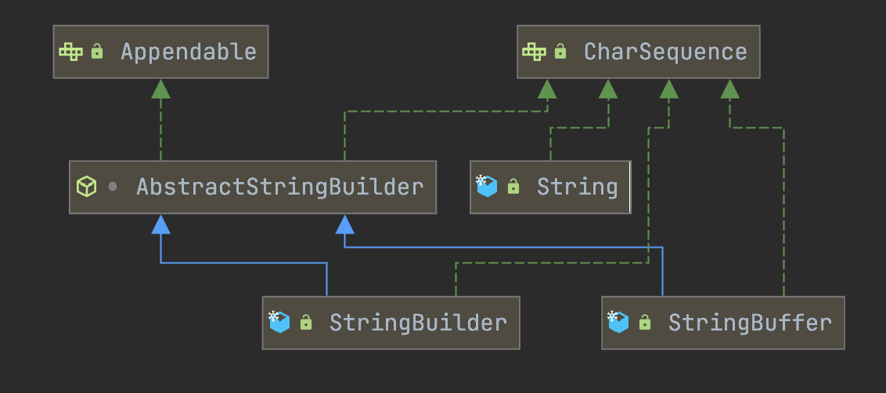

基于 jdk8 <https://docs.oracle.com/javase/8/docs/api/index.html>

# 异常系列

## 概览


### 检查异常（Checked Exception）

检查异常是指必须要被手动处理的异常，手动处理的方式有两种，一种是使用`try...catch`捕获，第二种是使用`throw`继续抛出。

### 抑制异常（Suppressed Exception）

[相关阅读](https://stackoverflow.com/questions/7849416/what-is-a-suppressed-exception)

`try...catch...finally`场景中，可能会在三个语句块中分别抛出3个不同的异常，那么只有一个异常会被抛出，异常的优先级为finally>catch>try。也就是说如果try、catch、finally语句块中分别抛出异常A、B、C，那么只有C会被抛出，A和B就被抑制。如果try、catch分别抛出异常A、B，则只有B会被抛出。此时A被抑制。

在JDK7中伴随着`try-with-resources`语法，Throwable开始允许包含被抑制异常信息。可以通过`Throwable.addSuppressed(t)`向Throwable中添加被抑制的异常，通过`Throwable.getSupressed()`获取该Throwable抑制的其他异常。

这和JDK1.4中引入的异常链不同，异常链中的异常是因果关系，表达的是异常的连锁反应；抑制异常中的异常没有任何关系，表达的是多个异常的返回结果。


## [Throwable](https://docs.oracle.com/javase/8/docs/api/java/lang/Throwable.html)

是Java语言中所有异常的父类。仅Throwable或其子类能被JVM或Java抛出，同样只有Throwable或其子类能有被用在catch语句中。

Throwable的所有子类中，除了RuntimeException和Error的子类不是检查异常，其他异常都是检查异常。

Throwable包含的信息有：
+ new 异常时当前线程的堆栈快照
+ 一个简要的异常信息
+ 该异常抑制(suppress)的其他异常
+ 异常链

如果要建立异常链，可以通过构造方法，或者`initCause(t)`方法创建异常间的联系。

### public String getMessage()

简要描述异常的详情，用于方便定位异常的具体原因

``` java
private String detailMessage;
```

### public synchronized Throwable getCause()

保存诱发此结果异常的原因异常。递归`getCause()`即可形成异常链。
默认cause=this，所以如果cause==this，表示没有初始化过原因异常。
`initCause()`方法中会判断cause是否不等于this来保证只能被初始化一次。

``` java
private Throwable cause = this;
```

### public void printStackTrace()

打印这个异常，和这个异常抑制的所有异常，和这个异常的所有异常链中的堆栈信息，格式一般如下（注意缩进规则，抑制异常也可以有异常链）：

```
Exception in thread "main" java.lang.Exception: Main block
    at Foo3.main(Foo3.java:7)
    Suppressed: Resource$CloseFailException: Resource ID = 2
            at Foo3.main(Foo3.java:5)
    Caused by: java.lang.Exception: Rats, you caught me
            at Resource2$CloseFailException.<init>(Resource2.java:45)
            ... 2 more
Caused by: java.lang.Exception: I did it
    at Foo3.main(Foo3.java:8)
```

```java
/*
* 表示空堆栈，在所有空堆栈的异常中共享此字段
*/
private static final StackTraceElement[] UNASSIGNED_STACK = new StackTraceElement[0];
private StackTraceElement[] stackTrace = UNASSIGNED_STACK;

/*
* 调用本地方法来填充堆栈
*/
private native Throwable fillInStackTrace(int dummy);
```

### public void setStackTrace(StackTraceElement[] stackTrace)

可以手动设置异常的堆栈信息，一般用于给RPC框架等高级系统使用，来填充client端的异常堆栈。

### public final synchronized void addSuppressed(Throwable exception)

添加被此异常抑制的异常，此方法是线程安全的，通常由 try-with-resources 语句调用（自动和隐式）。

可以通过构造函数禁用抑制行为。

## Exception

Exception类的任何非RuntimeException子类表示需要应用程序检查的异常。

1. ReflectiveOperationException：由反射操作抛出的所有异常的父类
   1. NoSuchMethodException：当反射找不到特定方法时抛出
   2. ClassNotFoundException：当应用尝试通过类的字符串名称加载类，但反射找不到指定名称的类定义时抛出：
     + 使用Class类的forName方法
     + 使用ClassLoader类的findSystemClass方法
     + 使用ClassLoader类的loadClass方法
   3. IllegalAccessExcepiton：当通过反射创建实例、设置或获取字段、调用实例方法，但没有访问权限时抛出。可以通过`setAccessible(true)`来获得权限
   4. InstantiationException：当应用调用Class类的newInstance方法创建实例，但实例化失败时抛出，实例化失败的原因包括但不限于：
      + Class是抽象类、接口、数组、原始类型、或void的类型
      + Class表示的类没有无参构造函数
   5. NoSuchFieldException：当反射时该类没有指定名称的field时抛出
2. InterruptedException：当线程处于等待、睡眠或其他方式被占用，并且被其他线程中断时自动抛出。运行中的线程可以通过`Thread.interrupted()`检测当前线程来判断是否已经被中断
3. CloneNotSupportedException：调用clone方法，但对象未实现Cloneable接口时抛出。重写方法也可以抛出此异常表示对象不能被克隆
4. RuntimeException：未检查异常的父类。此类异常一般由代码不健壮引起，可以通过完善编码来避免。
   1. ArrayStoreException：向数组插入非此数组类型的对象时抛出。`Object x[]=new String[2];x[0]=new Integer(0);`
   2. NegativeArraySizeException：当尝试创建数组时指定的数组大小为负数时抛出
   3. ArithmeticException：执行错误的算术时抛出，比如除0
   4. IllegalStateException：表示在不适当的时候调用了方法。比如在对象还未初始化完方法就被调用时可以抛出
   5. TypeNotPresentException：该异常与ClassNotFoundException的不同是该异常非检查异常
   6. EnumConstantNotPresentException：通过名称访问不存在的枚举值是抛出，该异常可能在反射时被抛出
   7. IndexOutOfBoundsException：索引超出范围时抛出
      1. StringIndexOutOfBoundsException：访问字符串索引位置超过字符串范围时抛出
      2. ArrayIndexOutOfBoundsException：访问数组索引位置超过索引范围时抛出
   8. NullPointerException：当使用对象，但对象为null时抛出
   9. UnsupportedOperationException：不支持请求的操作，一般表示不同的实现类不支持某个父类方法，此异常是[Java Collections Framework](https://docs.oracle.com/javase/8/docs/technotes/guides/collections/index.html)的成员
   10. IllegalMonitorStateException：在未获得的监视器上调用wait或notify方法时抛出
   11. ClassCastException：强制转换对象类型不一致时抛出，比如`(String)new Integer(0)`
   12. SecurityException：由安全管理器抛出，表示有安全违规行为，比如用户自己定义了一个与jdk内置同名的包并使用包下的类时。比如如果定义了一个`java.lang`包，并在这个包下定义了一个类，加载和使用这个类就会抛出SecurityException
   13. IllegalArgumentException：参数非法时抛出
       1.  NumberFormatException：解析非数字格式的字符串为数字时抛出
       2.  IllegalThreadStateException：当线程未处于请求的适当状态抛出，例如参见Thread类的suspend和resume方法

## Error

Error 表示不应该由应用程序捕获的严重错误，及时发生也无法恢复，通常由JVM运行错误引起。ThreadDeath 错误虽然是一种正常的情况，但也不应该手动捕获。Error及其子类被视为未检查异常。

1. AssertionError：使用assert关键字断言失败时抛出
2. ThreadDeath：当调用`Thread.stop`(deprecated)方法时，会在被停止的线程抛出ThreadDeath错误。仅当在需要的时候才应该捕获此错误，捕获后一定要将其重新抛出，保证让线程确实死亡。未捕获的ThreadDeath不会在[顶级异常处理程序](https://docs.oracle.com/javase/8/docs/api/java/lang/ThreadGroup.html#uncaughtException-java.lang.Thread-java.lang.Throwable-)中打印出消息。虽然线程死亡是正常发生的情况，但因为许多程序都会直接捕获Exception然后丢弃，所以此异常的父类是Error。
3. VirtualMachineError：当JVM出现错误，或者系统资源耗尽的时候抛出
   1. InternalError：表示JVM发生了一些意外的错误
   2. StackOverflowError：当递归深度超过栈大小时抛出，可以通过不停止的递归来触发
   3. OutOfMemoryError：当JVM由于内存不足无法创建对象，并且GC无法提供更多内存时抛出
   4. UnknownError：当JVM发生未知且严重的异常时抛出
4. LinkageError：此错误表示，当A类对B类有某种依赖，但是在A类已经编译完成后，B类发生了不兼容A类的变化
   1. ClassCircularityError：当JVM检测到循环依赖时抛出。JVM通过队列来检测循环依赖，当队列中的出现重复时认为出现循环
   2. NoClassDefFoundError：如果JVM或ClassLoader尝试加载类（正常的方法调用，或new新实例）但找不到类定义时抛出。这种情况的发生由于编译时能够搜索到类定义存在，但运行时无法找到类定义
   3. BootstrapMethodError：当invokedynamic指令未找到其引导的方法，或其引导的方法无法为目标方法类型提供[call site](https://docs.oracle.com/javase/8/docs/api/java/lang/invoke/CallSite.html)
   4. VerifyError：当JVM的验证器检测到java文件虽然格式正确，但是包含内部不一致或安全问题时抛出
   5. UnsatisfiedLinkError：JVM找不到native本地方法的定义时抛出
   6. ExceptionInInitializerError：表示JVM在初始化静态变量时发生了异常
   7. ClassFormatError：JVM读取一个格式错误的java文件时抛出
      1. UnsupportedClassVersionError：当java文件中的主要和次要版本号不受当前JVM支持时抛出
   8. IncompatibleClassChangeError：当前执行的方法所依赖的类的定义被改变时抛出
      1. AbstractMethodError：调用抽象方法时抛出。正常情况下这个错误可以被编译器捕获；但是当编译后的类定义发生了更改时可能在运行期间发生
      2. InstantiationError：当尝试创建抽象类或接口的实例时抛出。正常情况下这个错误可以被编译器捕获；但是当编译后的类定义发生了更改时可能在运行期间发生
      3. NoSuchFieldError：当尝试使用不存在的字段时抛出。正常情况下这个错误可以被编译器捕获；但是当编译后的类定义发生了更改时可能在运行期间发生
      4. NoSuchMethodError：当尝试使用不存在的方法时抛出。正常情况下这个错误可以被编译器捕获；但是当编译后的类定义发生了更改时可能在运行期间发生
      5. IllegalAccessError：当尝试访问没有访问权限的属性时抛出。正常情况下这个错误可以被编译器捕获；但是当编译后的类定义发生了更改时可能在运行期间发生

# 字符系列



## CharSequence

[相关阅读](https://en.wikipedia.org/wiki/Plane_(Unicode))

[相关阅读](https://blog.boileryao.com/2018/11/java-encoding-and-whats-codepoint/)

CharSequence 用来表示一系列只读的字符值。此接口提供对不同类型字符序列的统一只读访问。一个字符值表示Basic Multilingual Plane (BMP) 中的一个字符或一个[surrogate](https://docs.oracle.com/javase/8/docs/api/java/lang/Character.html#unicode)。

此接口没有约定equals和hashCode方法的具体实现，不能保证每个此接口实现的正确性，因此不建议在Set或Map的键中使用。


